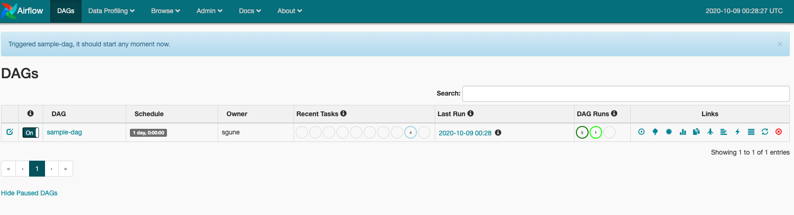
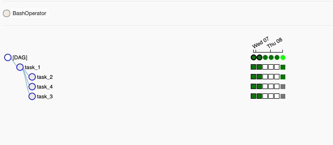
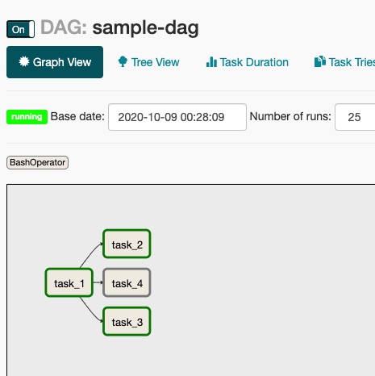
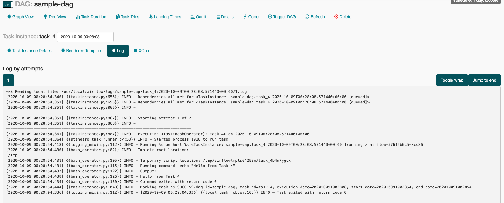

# Airflow Demo

Apache Airflow is “a platform to programmatically author, schedule and monitor workflows”. Essentially, it allows you to schedule tasks to run, run them in a particular order, and monitor / manage all of your tasks. So , OverPowered Cron.

## Concepts

### Directed Acyclic Graph (DAG)
A DAG is a collection of the tasks you want to run, along with the relationships and dependencies between the tasks. DAGs can be expressed visually as a graph with nodes and edges, where the nodes represent tasks and the edges represent dependencies between tasks (i.e. the order in which the tasks must run). Essentially, DAGs represent the workflow that you want to orchestrate and monitor in Airflow. They have no "loops" ergo they have a beginning and an end, which is why they are `acyclic`.

- DagRun : Its an instance of a DAG. It's created by the airflow-scheduler or can be triggered manually. They can have multiple completion times. It's basically metadata associated with the tasks.


### Operators 
Operators represent what is actually done in the tasks that compose a DAG workflow. Specifically, an operator represents a single task in a DAG. Airflow provides a lot of pre-defined classes with tons of flexibility about what you can run as tasks. This includes classes for very common tasks, like BashOperator, PythonOperator, EmailOperator, OracleOperator, etc. On top of the multitude of operator classes available, Airflow provides the ability to define your own operators. As a result, a task in your DAG can do almost anything you want, and you can schedule and monitor it using Airflow.

### Tasks
A running instance of an operator. During the instantiation, you can define specific parameters associated with the operator and the parameterized task becomes a node in a DAG. Task can be an `operator`, `sensor` or a `hook`

- TaskInstance: It's the `run` of the task at a point-of-time, are `runnable` and belong to `DagRun`

## Running it locally

```
docker run -d -p 8080:8080 -v $(pwd)/dags:/usr/local/airflow/dags puckel/docker-airflow webserver
```
> Browse to `http://localhost:8080/admin/` to get your admin dashboard.

If you don't want to have this in a k8s cluster, you can head over to the [Testing](#Testing) and try creating `DagRuns` yourself.

## Deploy in Minikube

```
minikube config set cpu 4
minikube start
minikube addons enable helm-tiller
```

You'll need to do this in a different terminal because 
```
✅  Successfully mounted ./DAGS to /DAGS
📌  NOTE: This process must stay alive for the mount to be accessible 
...
```

> You could ssh into minikube using `minikube ssh` and then confirm that the `DAGS` folder is mounted in root :`/DAGS`

```
# dry-run to make sure everything looks good
helm install --name airflow airflow/ --dry-run --debug

# proper install
helm install --name airflow airflow/

==> v1/ConfigMap
NAME               DATA  AGE
airflow-configmap  2     45m

==> v1/Deployment
NAME     READY  UP-TO-DATE  AVAILABLE  AGE
airflow  1/1    1           1          45m

==> v1/Pod(related)
NAME                     READY  STATUS   RESTARTS  AGE
airflow-576f5b6c5-kxs86  1/1    Running  0         45m

==> v1/Service
NAME     TYPE       CLUSTER-IP     EXTERNAL-IP  PORT(S)   AGE
airflow  ClusterIP  10.103.58.167  <none>       8080/TCP  45m
```

## Testing 
```
kubectl port-forward svc/airflow 8080
```
> Browse to `http://localhost:8080/admin/` to get your admin dashboard.

Click on the `turn DAG on` button. The `DagRun` should be picked up automatically. You can also trigger one if you want.







# Cleanup
`minikube delete`
